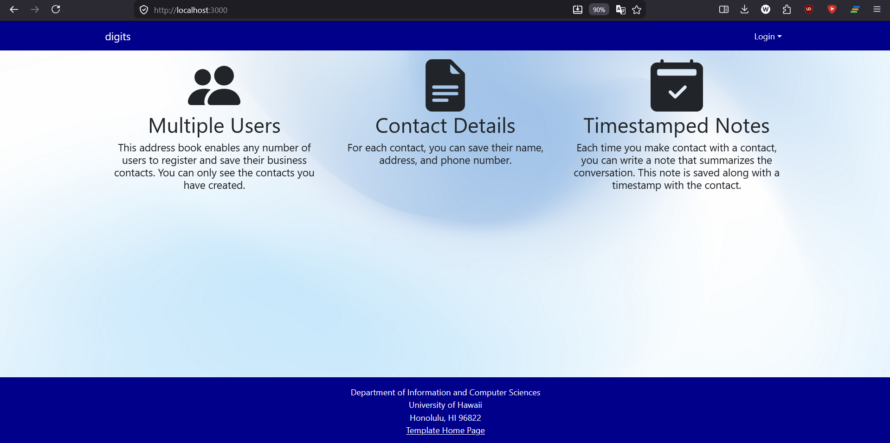
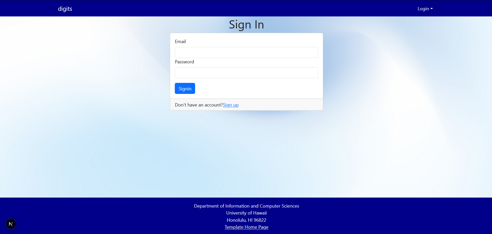
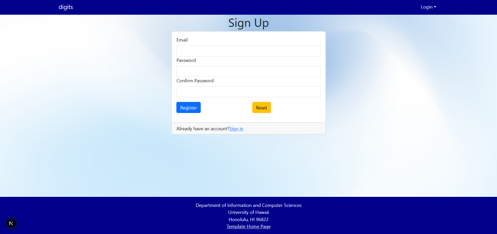
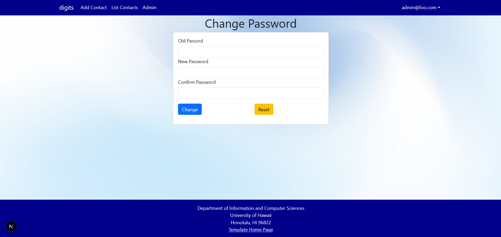
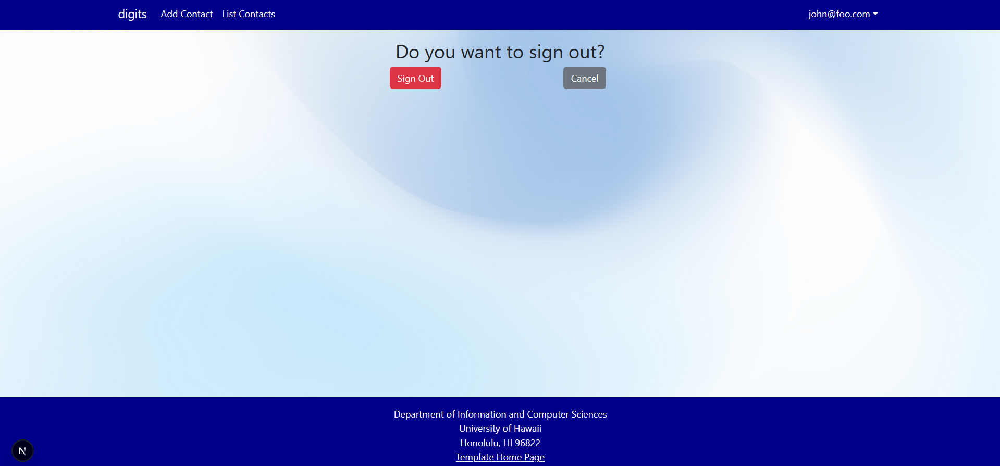
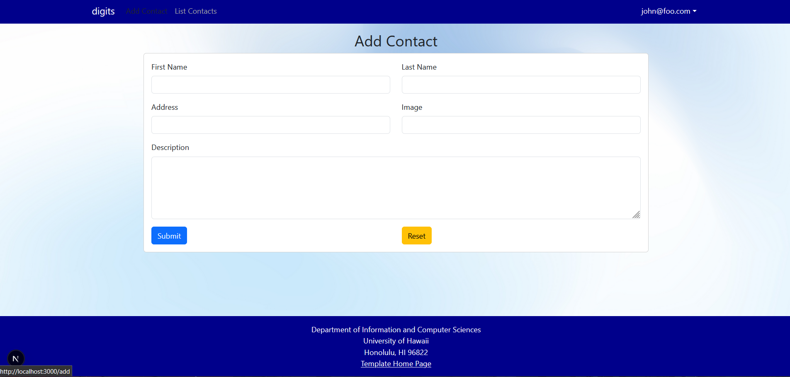
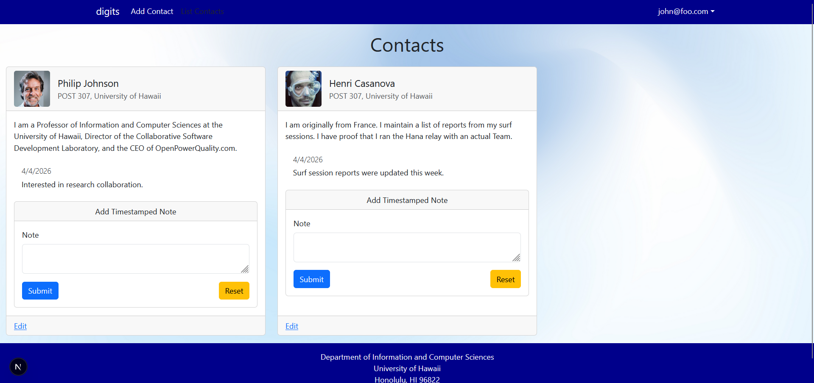
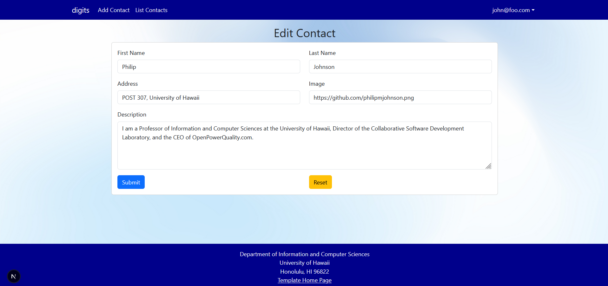
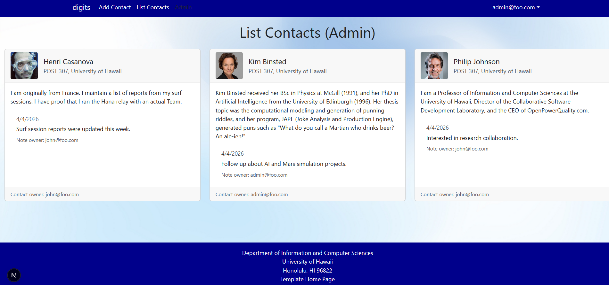

# Digits

Digits is a multi-user contact manager built with Next.js, React Bootstrap, NextAuth, Prisma, and PostgreSQL. Users can register, sign in, create contacts, edit their own contacts, and attach timestamped notes to each contact. Admin users can view all contacts across the system.

## Installation

1. Create a PostgreSQL database for the project.

```bash
createdb digits
```

2. Install dependencies.

```bash
npm install
```

3. Create `.env` from `sample.env`, then update `DATABASE_URL` so it points to your local PostgreSQL database.

4. Apply the Prisma migrations.

```bash
npx prisma migrate dev
```

5. Generate the Prisma client.

```bash
npx prisma generate
```

6. Seed the database with the default users, contacts, and notes from [`config/settings.development.json`](config/settings.development.json).

```bash
npm run seed
```

7. Start the development server.

```bash
npm run dev
```

The app runs at `http://localhost:3000`.

## Application Walkthrough

### Landing Page

The landing page at `/` introduces the application. It explains the three main ideas behind the system: multiple users, stored contact details, and timestamped notes for each contact.


### Sign In Page

The sign in page at `/auth/signin` authenticates existing users. After login, the navigation bar exposes the protected application pages.



### Sign Up Page

The sign up page at `/auth/signup` allows a new user to create an account. New users are stored in the database and can immediately sign in to manage their own contacts.



### Change Password Page

The page at `/auth/change-password` lets an authenticated user update their password.



### Sign Out Page

The page at `/auth/signout` confirms that the current user wants to end their session.



### Add Contact Page

The page at `/add` provides a form for creating a contact. Each contact stores a first name, last name, address, image URL, description, and owner email.



### List Contacts Page

The page at `/list` shows all contacts owned by the currently logged-in user. Each contact appears as a card with profile image, address, description, existing notes, a form to add a new note, and a link to edit that contact.



### Edit Contact Page

The page at `/edit/[id]` allows a user to modify an existing contact they created. It reuses the contact form structure with the current values preloaded.



### Admin Page

The page at `/admin` is restricted to users with the `ADMIN` role. It displays all contacts and their notes across all users, along with the owner of each contact.



## Default Accounts

The development settings file defines these default accounts:

- `admin@foo.com` / `changeme` for an administrator account.
- `john@foo.com` / `changeme` for a regular user account.

## Screenshot Notes

The screenshots are stored in the `doc/` directory and referenced directly from this page. If you add a dedicated edit-contact screenshot later, I can replace the temporary image used in that section.
